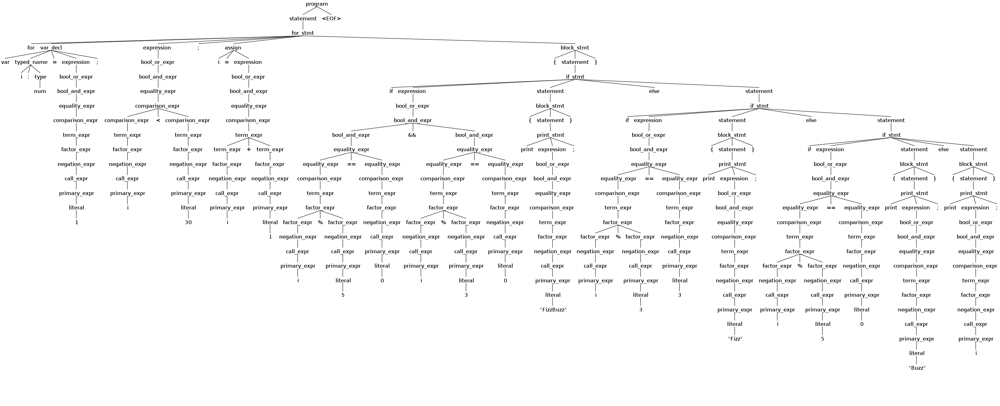

# Sprachkonzepte Bericht Hendrik Ziegler

## Aufgabe 1

Aufgabe war es einen Tokenizer für Abfahrten der DB zu schreiben, der einen mit Antlr4 generierten Lexer verwendet.

Die Grammatik, die am Ende herrauskam sah so aus:
```
lexer grammar Abfahrten;

fragment Digit: ([0-9]) ;
fragment Alphanumeric: ([_a-zA-Z0-9äöüÄÖÜß]) ;

// literals
TIME: ( ( [0-1][0-9] | '2'[0-3] ) ':' [0-5][0-9] ) ;
MONTH: 'Jan' | 'Feb' | 'Mär' | 'Apr' | 'Mai' | 'Jun' | 'Jul' | 'Aug' | 'Sep' | 'Okt' | 'Nov' | 'Dez' ;
DAY: 'Mo' | 'Di' | 'Mi' | 'Do' | 'Fr' | 'Sa' | 'So' ;
MONTH_DAY: (Digit)+ '.' ;
NUMBER: (Digit)+ ;
BUS: 'Bus' ;
BAHN: 'S' | 'RB' | 'RE' | 'IRE' | 'FEX' | 'MEX' | 'IC' | 'ICE' ;

// keywords
NICHT: 'nicht' ;
TAEGLICH: 'täglich' ;
NACH: 'nach' ;

// identifier
IDENTIFIER: Alphanumeric+ ;

// symbols
COMMA: ',' ;
// DOT: '.' ;
SEMICOLON: ';' ;
DASH: '-' ;
LPAREN: '(' ;
RPAREN: ')' ;
SLASH: '/' ;

// whitespace
WS: [ \t\r\n]+ -> channel(HIDDEN);
```

In dieser Grammatik finden sich einige Vokabular-Kategorien aus der Vorlesung, namentlich:
  - Whitespace (wird hier übersprungen, da nicht relevant)
  - Identifier (Haltestellen Namen, unbekannte Zug/Bus Arten (wie z.B. "KAT"))
  - Keywords ("nach", "täglich", "nicht")
  - Literale (TIME, MONTH, ...)
  - Symbole (',', ';', etc.)

Nach einem ersten Versuch fand ich auch herraus, das Regeln, die weiter oben definiert sind eine höhere Precedence haben.
Die "IDENTIFIER" Regel muss in dieser Grammatik also unter den Literalen stehen,
da sonst z.B. "Mon" als IDENTIFIER und nicht als DAY erkannt wird.

Es war interessant sich zu überlegen in was für Tokens der Text zerlegt werden sollte.
Sollten z.B. Wochentage oder Monatsabkürzungen einfach als IDENTIFIER gewertet werden? Ich entschied mich dafür,
sie als eigene Token zu lexen, da sie im gegebenen Kontext doch von Haltestellen Namen etc. zu unterscheiden sind.

Eine weitere Überlegung war, wie Haltestellen etc. von anderen Identifiern unterschieden werden.
Am Ende habe ich sie gar nicht unterschieden, sondern denke, dass der Parser das übernehmen sollte.
Letztendlich ist nämlich klar, dass nach einem "nach" ein kompletter Orts/Stadt/Haltestellen Name kommt, welcher dann eben
aus mehreren IDENTIFIERN besteht.

Außerdem habe ich ein Datum nicht als 1 Token ('1. Okt') sondern als MONTH_DAY + MONTH gelext.
Der Grund dafür ist die Aufzählung mehrerer Daten (1., 2., 25. Aug). Wenn Tag + Monat ein einziges Token wären,
könnte so ein Konstrukt nicht trivial geparset werden.

Eine Entscheidung, bei der ich mir nicht sicher bin ob sie gut ist, war es die Fahrzeug Art (Bus, RB, RE...) nicht als IDENTIFIER
sondern als eigenes Keyword einzubauen. Meine Überlegung war es, dass 95% aller Fälle mit Keywords abgedeckt werden können
und sollte man dann doch so etwas wie den KAT entdecken (den es wohl nur in Konstanz/FN gibt?) so könnte man diese Sonderfälle
extra als IDENTIFIER behandeln.

Der Tokenizer ist nicht sehr interessant, aber hier ein Beispiel Input und Output:

Input:
```
09:45 Bus 700 nach Bahnhof, Ravensburg
Mo - Mi
nicht 20. Mai
```

Output:
```
  1: TIME("09:45")
  1: BUS("Bus")
  1: NUMBER("700")
  1: NACH("nach")
  1: IDENTIFIER("Bahnhof")
  1: COMMA(",")
  1: IDENTIFIER("Ravensburg")
  2: DAY("Mo")
  2: DASH("-")
  2: DAY("Mi")
  3: NICHT("nicht")
  3: MONTH_DAY("20.")
  3: MONTH("Mai")

With Whitespace:

  1: TIME("09:45")
  1: WS(" ")
  1: BUS("Bus")
  1: WS(" ")
  1: NUMBER("700")
  1: WS(" ")
  1: NACH("nach")
  1: WS(" ")
  1: IDENTIFIER("Bahnhof")
  1: COMMA(",")
  1: WS(" ")
  1: IDENTIFIER("Ravensburg")
  1: WS("\r\n")
  2: DAY("Mo")
  2: WS(" ")
  2: DASH("-")
  2: WS(" ")
  2: DAY("Mi")
  2: WS("\r\n")
  3: NICHT("nicht")
  3: WS(" ")
  3: MONTH_DAY("20.")
  3: WS(" ")
  3: MONTH("Mai")
  3: WS("\r\n")

```

## Aufgabe 2

a)

Ich habe als Basis für meine Sprache [Lox](https://craftinginterpreters.com/the-lox-language.html) gewählt und habe vor
dieses um Operatoren und Typisierung zu erweitern um am Ende bei der noch nicht finalen Sprache "HTWGLox" herauszukommen.
Der Code kann auf [Github](https://github.com/bafto/HTWGLox) gefunden werden.

Ein Hello-World in HTWGLox sieht so aus:
```
print "Hello World";
```
Und FizzBuzz so:
```
for var i: num = 1; i < 30; i = i + 1 {
  if i % 5 == 0 && i % 3 == 0 {
    print "FizzBuzz";
  } else if i % 3 == 3 {
    print "Fizz";
  } else if i % 5 == 0 {
    print "Buzz";
  } else {
    print i;
  }
}
```

Wer lox kennt wird bemerken, dass ich hier den % Operator hinzugefügt habe, Typisierung für Variablen (var i: num),
und des Stils wegen einige Klammern bei Bedingungen und Schleifen weggelassen habe.

Die Lexer und Parser Grammatik sehen im Moment wie unten angegeben aus, werden sich aber sicherlich noch deutlich verändern.

Lexer Grammar:
```java
lexer grammar HTWGLoxLexer;

fragment Digit: ([0-9]) ;
fragment Alpha: ([_a-zA-ZäöüÄÖÜß]) ;
fragment Alphanumeric: ([_a-zA-Z0-9äöüÄÖÜß]) ;

// literals
NUMBER_LITERAL: Digit+ ('.' Digit+)? ;
STRING_LITERAL: '"' (~["])* '"' ;
TRUE: 'true' ;
FALSE: 'false' ;

// keywords
FUNC: 'func' ;
RETURN: 'return' ;
VAR: 'var' ;
NUM: 'num' ;
STR: 'str' ;
BOOL: 'bool' ;
PRINT: 'print' ;
IF: 'if' ;
ELSE: 'else' ;
FOR: 'for' ;

// identifier
IDENTIFIER: Alpha Alphanumeric* ;

// symbols
COMMA: ',' ;
COLON: ':' ;
SEMICOLON: ';' ;
LPAREN: '(' ;
RPAREN: ')' ;
LCBRACE: '{' ;
RCBRACE: '}' ;
ARROW: '->' ;
DASH: '-' ;
SLASH: '/' ;
STAR: '*' ;
PLUS: '+' ;
NOT_EQUAL: '!=' ;
EXCLAMATION_MARK: '!' ;
EQUAL: '==' ;
ASSIGN: '=' ;
GREATER_EQUAL: '>=' ;
LESS_EQUAL: '<=' ;
LESS: '<' ;
GREATER: '>' ;
PERCENT: '%' ;
AND: '&&' ;
OR: '||' ;

// whitespace
WS: [ \t\r\n]+ -> channel(HIDDEN) ;

COMMENT: '/*' .*? '*/' -> channel(HIDDEN) ;

LINE_COMMENT: '//' ~[\r\n]* -> channel(HIDDEN) ;

INVALID: .+? ;
```

Parser grammar:
```java
parser grammar HTWGLoxParser;

options { tokenVocab=HTWGLoxLexer; }

program         : ( declaration | statement )* EOF ;

// declarations

declaration     : func_decl | var_decl ;

func_decl       : 'func' IDENTIFIER '(' param_list ')' ('->' type)? block_stmt ;

param_list      : ( typed_name (',' typed_name)* )? ;

var_decl        : 'var' typed_name '=' expression ';' ;

typed_name      : IDENTIFIER ':' type ;

type            : NUM | STR | BOOL ;

// statements

statement       : print_stmt | if_stmt | for_stmt | assign_stmt | return_stmt | expression_stmt | block_stmt ;

print_stmt      : 'print' expression ';' ;

if_stmt         : 'if' expression statement ('else' statement)? ;

for_stmt        : 'for' var_decl? expression ';' assign? block_stmt ;

assign_stmt     : assign ';' ;

assign          : IDENTIFIER '=' expression ;

return_stmt     : 'return' expression ';' ;

expression_stmt : expression ';' ;

block_stmt      : '{' statement* '}' ;

// expressions

expression      : bool_or_expr ;

bool_or_expr    : bool_and_expr |
                bool_or_expr BOOL_OR bool_or_expr  ;

bool_and_expr   : equality_expr |
                bool_and_expr BOOL_AND bool_and_expr ;

equality_expr   : comparison_expr |
                equality_expr EQUAL equality_expr |
                equality_expr UNEQUAL equality_expr ;

comparison_expr : term_expr |
                  comparison_expr LESS_EQUAL comparison_expr |
                  comparison_expr GREATER_EQUAL comparison_expr |
                  comparison_expr LESS comparison_expr |
                  comparison_expr GREATER comparison_expr ;

term_expr       : factor_expr |
                  term_expr PLUS term_expr |
                  term_expr MINUS term_expr ;

factor_expr     : negation_expr |
                  factor_expr STAR factor_expr |
                  factor_expr SLASH factor_expr |
                  factor_expr PERCENT factor_expr ;

negation_expr   : call_expr |
                  MINUS negation_expr |
                  EXCLAMATION_MARK negation_expr ;

call_expr       : primary_expr | 
                  IDENTIFIER '(' arg_list ')' ;

arg_list        : ( expression (',' expression)* )? ;

primary_expr    : grouping_expr | literal | IDENTIFIER ;

grouping_expr   : '(' expression ')' ;

literal         : NUMBER_LITERAL | STRING_LITERAL | TRUE | FALSE ;
```

Der ParseTree des oben gezeigten Hello-World ist denkbar simpel:

Der ParseTree für FizzBuzz ist schon deutlich größer:


Um den Daraus generierten ParseTree in einen AST umzuwandeln habe ich folgende Klassen definiert:
- AssignStmt.java
- BinaryExpr.java
- BlockStmt.java
- BoolLiteral.java
- CallExpr.java
- Declaration.java
- ExprStmt.java
- Expression.java
- ForStmt.java
- FuncDecl.java
- Identifier.java
- IfStmt.java
- Node.java
- NumberLiteral.java
- PrintStmt.java
- Program.java
- ReturnStmt.java
- Statement.java
- StringLiteral.java
- Type.java
- UnaryExpr.java
- VarDecl.java

Diese Klassen sehen Beispielweise so aus:
```java
package ast;

public class BinaryExpr implements Expression {
  public final Expression lhs;
  public final BinaryOp op;
  public final Expression rhs;

  public BinaryExpr(final Expression lhs, final BinaryOp op, final Expression rhs) {
    this.lhs = lhs;
    this.op = op;
    this.rhs = rhs;
  }

  public String toString() {
    return String.format(
        "BinaryExpr(lhs = %s, op = %s, rhs = %s)", lhs.toString(), op.toString(), rhs.toString());
  }

  enum BinaryOp {
    PLUS,
    MINUS,
    MULT,
    DIV,
    MOD,
    EQUAL,
    UNEQUAL,
    LESS,
    GREATER,
    LESS_EQUAL,
    GREATER_EQUAL,
    AND,
    OR,
  }
}
```
und werden beispielweise so aus dem ParseTree generiert:

```java
    @Override
    public void exitComparison_expr(Comparison_exprContext ctx) {
      if (ctx.LESS_EQUAL() != null) {
        Expression rhs = (Expression) nodes.pop();
        Expression lhs = (Expression) nodes.pop();
        nodes.add(new BinaryExpr(lhs, BinaryOp.LESS_EQUAL, rhs));
      } else if (ctx.GREATER_EQUAL() != null) {
        Expression rhs = (Expression) nodes.pop();
        Expression lhs = (Expression) nodes.pop();
        nodes.add(new BinaryExpr(lhs, BinaryOp.GREATER_EQUAL, rhs));
      } else if (ctx.LESS() != null) {
        Expression rhs = (Expression) nodes.pop();
        Expression lhs = (Expression) nodes.pop();
        nodes.add(new BinaryExpr(lhs, BinaryOp.LESS, rhs));
      } else if (ctx.GREATER() != null) {
        Expression rhs = (Expression) nodes.pop();
        Expression lhs = (Expression) nodes.pop();
        nodes.add(new BinaryExpr(lhs, BinaryOp.GREATER, rhs));
      }
    }
```

Die oben gezeigten Hello-World und FizzBuzz Programme sehen als AST nun so aus:

HelloWorld AST:
```
Program.printString() = Program(nodes = PrintStmt(rhs = StringLiteral(val = Hello World));)
```

FizzBuzz AST:
```
Program.printString() = Program(nodes = ForStmt(decl = VarDecl(name = Identifier(name = i), type = NUM, initializer = Numbe
rLiteral(val = 1.00000)), condition = BinaryExpr(lhs = Identifier(name = i), op = LESS, rhs = NumberLiteral(val = 30.0000))
, end_stmt = AssignStmt(name = Identifier(name = i), Expr = BinaryExpr(lhs = Identifier(name = i), op = PLUS, rhs = NumberL
iteral(val = 1.00000))), body = BlockStmt(IfStmt(condition = BinaryExpr(lhs = BinaryExpr(lhs = BinaryExpr(lhs = Identifier(
name = i), op = MOD, rhs = NumberLiteral(val = 5.00000)), op = EQUAL, rhs = NumberLiteral(val = 0.00000)), op = AND, rhs = 
BinaryExpr(lhs = BinaryExpr(lhs = Identifier(name = i), op = MOD, rhs = NumberLiteral(val = 3.00000)), op = EQUAL, rhs = Nu
mberLiteral(val = 0.00000))), body = BlockStmt(PrintStmt(rhs = StringLiteral(val = FizzBuzz));), else_body = IfStmt(conditi
on = BinaryExpr(lhs = BinaryExpr(lhs = Identifier(name = i), op = MOD, rhs = NumberLiteral(val = 3.00000)), op = EQUAL, rhs
 = NumberLiteral(val = 3.00000)), body = BlockStmt(PrintStmt(rhs = StringLiteral(val = Fizz));), else_body = IfStmt(conditi
on = BinaryExpr(lhs = BinaryExpr(lhs = Identifier(name = i), op = MOD, rhs = NumberLiteral(val = 5.00000)), op = EQUAL, rhs
 = NumberLiteral(val = 0.00000)), body = BlockStmt(PrintStmt(rhs = StringLiteral(val = Buzz));), else_body = BlockStmt(Prin
tStmt(rhs = Identifier(name = i));))));));)
```

Wie man sieht werden im AST einige Terminale und Nichtterminale weggelassen.
Zum Beispiel aus den langen `equality_expr` Ästen werden einzelne BinaryExpr, die dann direkt die Literale als Kinder haben.
Nichtterminale wie `typed_name` werden ganz weggelassen, da sie in der grammatik nur wegen der Lesbarkeit und Wiederverwendbarkeit
vorhanden waren. 

## Aufgabe 3

### a)

Die statische Semantik in HTWGLox besteht hauptsächlich aus der Zuordnung der Variablen- und Funktion-Namen in Scopes,
sowie den Typen der Variablen und Werte.
Scopes funktionieren wie in den meisten Sprachen der C-Familie:
Jeder Name muss definiert worden sein bevor er benutzt werden kann:

```lox
print x; // Fehler, x noch nicht definiert
var x: num = 10;
{
    print x; // alles gut
}
```

Namen dürfen nicht mehrmals im selben scope definiert werden, können aber in sub-scopes überschrieben werden:

```lox
func foo() {
    print "foo";
}
var foo: num = 10; // Fehler, "foo" bereits definiert
{
    var foo: num = 10; // alles gut
    print foo;
}
```

Da alle Namen von oben nach unten in korrekter Reihenfolge definiert sein müssen, könnte man diese Regeln bereits
beim erstellen des ASTs prüfen. Ich habe mich allerdings dazu entschieden einen separaten `Resolver` zu implementieren
um die AST erstellung kleiner zu halten.
Außerdem kam ich so bereits dazu das Visitor-Pattern umzusetzen, was ich später für einen Interpreter sowieso brauchen werde.

Das Visitor-Pattern besteht hauptsächlich aus dem Visitor-Interface:
```java
public interface Visitor<T> {
  private T visit(Node n) {
    if (n != null) {
      return n.accept(this);
    }
    return null;
  }

  public default T visitFuncDecl(FuncDecl stmt) {
    visit(stmt.body);
    return null;
  }

  public default T visitVarDecl(VarDecl stmt) {
    visit(stmt.initializer);
    return null;
  }

  public default T visitIdentifier(Identifier expr) {
    return null;
  }

  public default T visitUnaryExpr(UnaryExpr expr) {
    visit(expr.rhs);
    return null;
  }

  public default T visitBinaryExpr(BinaryExpr expr) {
    visit(expr.rhs);
    visit(expr.lhs);
    return null;
  }

  public default T visitStringLiteral(StringLiteral expr) {
    return null;
  }

  public default T visitNumberLiteral(NumberLiteral expr) {
    return null;
  }

  public default T visitBoolLiteral(BoolLiteral expr) {
    return null;
  }

  public default T visitCallExpr(CallExpr expr) {
    for (var n : expr.args) {
      visit(n);
    }
    return null;
  }

  public default T visitAssignStmt(AssignStmt stmt) {
    visit(stmt.rhs);
    return null;
  }

  public default T visitBlockStmt(BlockStmt stmt) {
    for (var s : stmt.statements) {
      visit(s);
    }
    return null;
  }

  public default T visitExprStmt(ExprStmt stmt) {
    visit(stmt.expr);
    return null;
  }

  public default T visitForStmt(ForStmt stmt) {
    visit(stmt.decl);
    visit(stmt.condition);
    visit(stmt.body);
    visit(stmt.end_stmt);
    return null;
  }

  public default T visitIfStmt(IfStmt stmt) {
    visit(stmt.condition);
    visit(stmt.body);
    visit(stmt.else_body);
    return null;
  }

  public default T visitPrintStmt(PrintStmt stmt) {
    visit(stmt.rhs);
    return null;
  }

  public default T visitReturnStmt(ReturnStmt stmt) {
    visit(stmt.rhs);
    return null;
  }

  public default T visitDeclStmt(DeclStmt stmt) {
    visit(stmt.decl);
    return null;
  }
}
```

Jede AST-Node muss nun die Accept Methode implementieren:
```java
public interface Node {
  public <T> T accept(Visitor<T> visitor);
}

// ...

public interface Expression extends Node {}

// ...

public class BinaryExpr implements Expression {
  // ...

  public <T> T accept(Visitor<T> visitor) {
    return visitor.visitBinaryExpr(this);
  }

  // ...
```

Die Resolver Klasse implementiert nun einen Teil dieses Interfaces:
```java
package ast;

import java.util.ArrayList;
import java.util.HashMap;
import java.util.List;
import java.util.Map;
import java.util.Stack;

public class Resolver implements Visitor<Void> {
  private Stack<Map<String, Declaration>> scopes = new Stack<>();
  private List<String> errors = new ArrayList<>();

  public Resolver(Program p) {
    resolve(p);
  }

  public List<String> getErrors() {
    return errors;
  }

  private void scopeStart() {
    scopes.push(new HashMap<>());
  }

  private void scopeEnd() {
    scopes.pop();
  }

  private void define(Declaration decl) {
    if (decl == null) {
      return;
    }

    if (scopes.peek().containsKey(decl.name())) {
      errors.add(String.format("Name '%s' already defined", decl.name()));
      return;
    }

    scopes.peek().put(decl.name(), decl);
  }

  private void resolve(final Program p) {
    scopeStart();
    for (Statement stmt : p.statements) {
      resolve(stmt);
    }
    scopeEnd();
  }

  private void resolve(final Statement stmt) {
    if (stmt != null) {
      stmt.accept(this);
    }
  }

  private void resolve(final Expression expr) {
    if (expr != null) {
      expr.accept(this);
    }
  }

  @Override
  public Void visitFuncDecl(FuncDecl f) {
    scopeStart();
    define(f);
    for (VarDecl param : f.params) {
      define(param);
    }
    resolve(f.body);
    scopeEnd();
    return null;
  }

  @Override
  public Void visitVarDecl(VarDecl d) {
    define(d);
    resolve(d.initializer);
    return null;
  }

  @Override
  public Void visitBlockStmt(BlockStmt stmt) {
    scopeStart();
    for (var s : stmt.statements) {
      resolve(s);
    }
    scopeEnd();
    return null;
  }

  @Override
  public Void visitIdentifier(Identifier ident) {
    int i = 1;
    var scope = scopes.peek();
    while (!scope.containsKey(ident.name)) {
      if (i >= scopes.size()) {
        scope = null;
        break;
      }
      scope = scopes.get(scopes.size() - i++);
    }

    if (scope == null) {
      errors.add(String.format("Name '%s' not yet defined", ident.name));
    }
    return null;
  }
}
```

Die Scopes sind sehr Simpel durch Stacks und Maps dargestellt.
Der Resolver kann nun so benutzt werden:

```java
    Program ast = new Program.Builder().build(tree);
    Resolver r = new Resolver(ast);
    for (String e : r.getErrors()) {
      System.out.println(e);
    }
```

Hier der Output des Resolvers für eine kleines Beispiel:
```lox
func foo(x: num, y: str) -> str {
  print "foo";
  print x;
  print z;
  if x == 0 {
    var z: num = 10;
    var x: num = 10;
    print z;
    print x;
  }
  return "hi";
}
```

Ausgabe:

```
Name 'z' not yet defined
```

Der Resolver erkennt, dass x bereits als Funktions Parameter definiert wurde, z allerdings noch nicht.

Die Überprüfung ob alle Typ-Einschränkungen eingehalten wurden könnte man auf eine ähnliche Weise umsetzten.
Man würde einen Visitor implementieren, welcher sich wie der Resolver aller Variablen der scopes bewusst ist und ihnen
ihre Typen zuordnet. Dieser Visitor könnte dann jeder Expression einen Typ zuordnen und so Überprüfen, dass das System stimmig ist.
Aus Zeit Gründen habe ich mich dagegen entschieden diesen Bereits zu implementieren.

### b)

Als dynamische Semantik habe ich mich entschieden einen kleinen Interpreter für HTWGLox zu implementieren.
Dafür habe ich eine Klasse `Interpreter` geschrieben, die das `Visitor<Object>` interface implementiert.

Hier kann man an Hand es Beispiels eines for-loops gut sehen, wie der Interpreter eine dynamische Semantik implementiert:
```java
  public Object visitForStmt(ForStmt stmt) {
    scopeStart();
    if (stmt.decl != null) {
      declareVar(stmt.decl);
    }
    while (evaluate(stmt.condition) instanceof Boolean b && b) {
      scopeStart();
      execute(stmt.body);
      scopeEnd();
      execute(stmt.end_stmt);
    }
    scopeEnd();
    return null;
  }
```

Der Interpreter kann die AST nodes auswerten und anhand der Ergebnisse entscheiden, welche als nächstes ausgeführt werden soll.
Die logik ist ziemlich simpel, unterstütz aber bereits jedes Feature der Sprache, bis auf Funktionsdeklarationen (die mir aufgrund
der Scoping Regeln vorerst zu kompliziert zu implementieren waren).

Dieser Interpreter kann das fizzbuzz beispiel bereits ausführen, und produziert das folgende Ergebnis:

```lox
for var i: num = 1; i < 30; i = i + 1 {
  if i % 5 == 0 && i % 3 == 0 {
    print "FizzBuzz";
  } else if i % 3 == 0 {
    print "Fizz";
  } else if i % 5 == 0 {
    print "Buzz";
  } else {
    print i;
  }
}
```

```java
public class HTWGLox {
  public static void main(String[] args) throws IOException {
    HTWGLoxLexer lexer = new HTWGLoxLexer(CharStreams.fromStream(System.in));
    HTWGLoxParser parser = new HTWGLoxParser(new CommonTokenStream(lexer));
    ParseTree tree = parser.program();

    if (parser.getNumberOfSyntaxErrors() > 0) {
      System.err.printf("%d error(s) detected%n", parser.getNumberOfSyntaxErrors());
      System.exit(1);
    }

    Program ast = new Program.Builder().build(tree);
    System.out.printf("Program.printString() = %s%n", ast.toString());
    Resolver r = new Resolver(ast);
    for (String e : r.getErrors()) {
      System.out.println(e);
    }
    Interpreter i = new Interpreter();
    for (var stmt : ast.statements) {
      i.execute(stmt);
    }
  }
}
```

`mvn exec:java -Dexec.mainClass=HTWGLox < fizzbuzz.lox`

Ausgabe:
```
1.0
2.0
Fizz
4.0
Buzz
Fizz
7.0
8.0
Fizz
Buzz
11.0
Fizz
13.0
14.0
FizzBuzz
16.0
17.0
Fizz
19.0
Buzz
Fizz
22.0
23.0
Fizz
Buzz
26.0
Fizz
28.0
29.0
```

## Aufgabe 4

a) In dem vollständigen Programm sind die eindeutigsten Prozeduralen stellen das schrittweise Aufrufen der einzelnen
Methoden (Prozeduren), die den Input Stück für Stück zum gewünschten Ergebnis umwandeln.
Auch das Nutzen der for-loops ist imperativer Stil.
Zuletzt haben alle utility Funktionen auch noch einen Seiteneffekt, nämlich das verändern ihrer Argumente.

Prozedural.java:
```java
import java.io.BufferedReader;
import java.io.IOException;
import java.nio.file.Files;
import java.nio.file.Paths;
import java.util.LinkedList;
import java.util.List;

public final class Procedural {
  private Procedural() {}

  private static final int MIN_LENGTH = 20;

  public static void main(String[] args) throws IOException {
    var input = Paths.get(args[0]);
    var lines = new LinkedList<String>();

    long start = System.nanoTime();

    // das aufrufen der einzelnen Methode, die redes mal ihren input verändern ist eindeutig
    // Prozedural,
    // da kein neuer Wert zurückgegeben, sondern eine bestehende Variable verändert wird
    readLines(Files.newBufferedReader(input), lines);
    removeEmptyLines(lines);
    removeShortLines(lines);
    int n = totalLineLengths(lines);

    long stop = System.nanoTime();

    System.out.printf("result = %d (%d microsec)%n", n, (stop - start) / 1000);
  }

  private static void readLines(final BufferedReader input, final List<String> lines)
      throws IOException {
    // loops eindeutig Prozedural
    for (String line; (line = input.readLine()) != null; ) {
      lines.add(line); // Seiteneffekt: verändern der Eingabe
    }
  }

  private static void removeEmptyLines(final List<String> lines) {
    // loops eindeutig Prozedural
    for (var it = lines.iterator(); it.hasNext(); ) {
      if (it.next().isBlank()) {
        it.remove(); // Seiteneffekt: verändern der Eingabe
      }
    }
  }

  private static void removeShortLines(final List<String> lines) {
    // loops eindeutig Prozedural
    for (var it = lines.iterator(); it.hasNext(); ) {
      if (it.next().length() < MIN_LENGTH) {
        it.remove(); // Seiteneffekt: verändern der Eingabe
      }
    }
  }

  private static int totalLineLengths(final List<String> lines) {
    int n = 0;
    // loops eindeutig Prozedural
    for (String line : lines) {
      n += line.length(); // verändern der variable eindeutig prozedural
    }
    return n;
  }
}
```

b) Bei der Funktionalen Variante sind alle Loops und If-Anweisungen verschwunden und wurden durch streams und filter ersetzt.
Das Programm ist deutlich kürzer, die gesamte Logik ist auf 5 Zeilen geschrumpft.

Functional.java:
```java
import java.io.IOException;
import java.nio.file.Files;
import java.nio.file.Paths;

public final class Functional {
  private Functional() {}

  private static final int MIN_LENGTH = 20;

  public static void main(String[] args) throws IOException {
    var input = Paths.get(args[0]);

    long start = System.nanoTime();

    // Funktionales berechnen des Endergebnisses
    final int n =
        Files.lines(input)
            .filter(line -> !line.isBlank())
            .filter(line -> line.length() >= MIN_LENGTH)
            .map(String::length)
            .reduce(0, (len, acc) -> len + acc);

    long stop = System.nanoTime();

    System.out.printf("result = %d (%d microsec)%n", n, (stop - start) / 1000);
  }
}
```

c) Um die Laufzeit der beiden Programme zu vergleichen habe ich mir Goethes-Faust als Beispiel Text genommen.
Das Original ist 190 Kilobyte groß, also immer noch recht klein für so einen Test. Ich habe also den Text genommen
und aneinandergehängt, bis ich das Original, eine 48MB und eine 95MB Version hatte.

Zusätzlich zu den beiden gegebenen Programmen habe ich aus Interesse die Funktionale Variante auch noch
mit einem .parallel() Stream getestet.

|          | Procedural.java | Functional.java | Functional.java - parallelized   |
|----------|-----------------|-----------------|-----------------------------------
| Original |      11 ms      |       9 ms      |           ~17 ms                 |
| 48 MB    |    ~600 ms      |    ~210 ms      |          ~150 ms                 |
| 95 MB    |   ~1100 ms      |    ~380 ms      |          ~260 ms                 |

Insgesamt kann man sehen, dass die Funktionale Variante merklich schneller ist als die Prozedurale.
Vor allem war sie auch deutlich leichter zu parallelisieren. Ich musste einfach `.parallel()` an den Anfang des
Streams schreiben um das gewünschte Ergebnis zu erzielen. Natürlich hat Parallelisierung bei kleinen Inputs
einen viel zu großen Overhead um nützlich zu sein, für größere Inputs war sie allerdings sehr hilfreich.
Das Prozedurale Programm zu parallelisieren hätte einen weitaus größeren Aufwand bedeutet.

## Aufgabe 5

a) Eck-Prolog 25:

|   Liste 1          |   Liste 2            |   Instaziierung                      |
|-------------       |-------------------   |--------------------------------------|
| [X, Y, Z]          | [john,likes,fish]    | X = john, Y = likes, Z = fish        |
| [cat]              | [X &#124; Y]         | X = cat, Y = []                      |
| [X, Y &#124; Z]    | [mary,likes,wine]    | X = mary, Y = likes, Z = [wine]      |
| [[the,Y] &#124; Z] | [[X,hare],[is,here]] |  X = the, Y = hare, Z = [[is, here]] |
| [golden &#124; T]  | [golden,norfolk]     | T = [norfolk]                        |
| [white,horse]      | [horse, X]           | false                                |
| [white &#124; Q]   | [ P, horse ]         |  P = white, Q = horse                |

Eck-Prolog 26 (Fakultät):

```prolog
fak(_, I) :- I < 0, !, false.
fak(1, 0).
fak(F, N) :- N1 is N-1, fak(R, N1), F is N * R.
```

Ergebnis:
```
?- fak(F, 0).  % F = 1
?- fak(F, 1).  % F = 1
?- fak(F, 6).  % F = 720
?- fak(F, -1). % false
```

Eck-Prolog 28 (append):

Beide Anfragen setzten X = [] und Y = [1, 2, 3, 4].

b)

```prolog
sum([], 0).
sum([A, B], S) :- S is A+B.
sum([H|T], S) :- sum(T, S2), S is H + S2.
```

Ergebnis:
```
?- sum([], S).        % S = 0
?- sum([1], S).       % S = 1
?- sum([1, 2, 3], S). % S = 6
```

c)

```prolog
% zug(Start, Abfahrt, Ziel, Ankunft).

zug(konstanz, 08.39, offenburg, 10.59).
zug(konstanz, 08.39, karlsruhe, 11.49).
zug(konstanz, 09.06, singen, 09.31).
zug(singen, 09.36, stuttgart, 11.32).
zug(offenburg, 11.28, mannheim, 12.24).
zug(karlsruhe, 12.06, mainz, 13.47).
zug(stuttgart, 11.51, mannheim, 12.28).
zug(mannheim, 12.39, mainz, 13.18).

% verbindung(Start, Abfahrt, Ziel, Reiseplan).

verbindung(Start, Abfahrt, Ziel, [ zug(Start, Ab, Ziel, An) ]) :- 
    zug(Start, Ab, Ziel, An),
    Ab >= Abfahrt,
    An > Ab.
verbindung(Start, Abfahrt, Ziel, R) :-
    zug(Umstieg, Uab, Ziel, An),
    verbindung(Start, Abfahrt, Umstieg, L),
    append(L, [zug(Umstieg, Uab, Ziel, An)], R).
```

Ausgabe für die query `verbindung(konstanz, 8.00, mainz, Reiseplan)` (wenn man sich immer wieder ergebnisse ausgeben lässt):

```prolog
Reiseplan = [zug(konstanz,8.39,karlsruhe,11.49), zug(karlsruhe,12.06,mainz,13.47)]
Reiseplan = [zug(konstanz,8.39,offenburg,10.59), zug(offenburg,11.28,mannheim,12.24), zug(mannheim,12.39,mainz,13.18)]
Reiseplan = [zug(konstanz,9.06,singen,9.31), zug(singen,9.36,stuttgart,11.32), zug(stuttgart,11.51,mannheim,12.28), zug(mannheim,12.39,mainz,13.18)]
false
```

## Aufgabe 6

Java code:

```java
import java.io.FileOutputStream;
import java.util.ArrayList;
import java.util.List;
import org.stringtemplate.v4.ST;
import org.stringtemplate.v4.STGroupFile;

public final class Main {
  private Main() {}

  public static void main(String[] args) throws Exception {
    List<Class<?>> classes = new ArrayList<>();
    for (String arg : args) {
      classes.add(Class.forName(arg));
    }

    ST templ = new STGroupFile("aufgabe6.stg").getInstanceOf("aufgabe6");
    templ.add("n", classes);
    String result = templ.render();
    System.out.println(result);
    FileOutputStream out = new FileOutputStream("aufgabe6.html");
    out.write(result.getBytes());
    out.close();
  }
}
```

aufgabe6.stg:

```
// aufgabe6.stg
delimiters "$", "$"

aufgabe6(n) ::= <<
<!DOCTYPE html>
<html lang="de">
<head>
<style type="text/css">
th, td { border-bottom: thin solid; padding: 4px; text-align: left; }
td { font-family: monospace }
</style>
</head>
<body>
<h1>Sprachkonzepte, Aufgabe 6</h1>
$n:main(); separator="\n"$
</body>
</html>
>>

main(c) ::= <<
$if(c.interface)$
$c:interface(); separator="\n"$
$else$
$c:class(); separator="\n"$
$endif$
>>

class(c) ::= <<
<h2>class $c.name$:</h2>
<table>
<tr><th>Interface</th><th>Methods</th></tr>
$c.interfaces:interfaces()$
</table>
<br>
>>

interfaces(i) ::= <<
<tr>
<td valign=top>$i.name$</td>
<td>$i.methods:method(); separator="\n"$</td>
</tr>
>>

method(m) ::= <<
$m.returnType.name$ $m.name$($m.parameters:parameter(); separator=","$)<br>
>>

parameter(p) ::= <<
$p.type.name$
>>

interface(i) ::= <<
<h2>interface $c.name$:</h2>
<table>
<tr><th>Methods</th></tr>
<td>$i.methods:method(); separator="\n"$</td>
</table>
<br>
>>
```

Beispielausgabe:

`mvn exec:java -Dexec.mainClass=Main -Dexec.args="java.lang.String java.util.Iterator java.time.Month"`

aufgabe6.html:

```html
<!DOCTYPE html>
<html lang="de">
<head>
<style type="text/css">
th, td { border-bottom: thin solid; padding: 4px; text-align: left; }
td { font-family: monospace }
</style>
</head>
<body>
<h1>Sprachkonzepte, Aufgabe 6</h1>
<h2>class java.lang.String:</h2>
<table>
<tr><th>Interface</th><th>Methods</th></tr>
<tr>
<td valign=top>java.io.Serializable</td>
<td></td>
</tr><tr>
<td valign=top>java.lang.Comparable</td>
<td>int compareTo(java.lang.Object)<br></td>
</tr><tr>
<td valign=top>java.lang.CharSequence</td>
<td>int length()<br>
java.lang.String toString()<br>
int compare(java.lang.CharSequence,java.lang.CharSequence)<br>
char charAt(int)<br>
boolean isEmpty()<br>
java.util.stream.IntStream codePoints()<br>
java.lang.CharSequence subSequence(int,int)<br>
java.util.stream.IntStream chars()<br></td>
</tr><tr>
<td valign=top>java.lang.constant.Constable</td>
<td>java.util.Optional describeConstable()<br></td>
</tr><tr>
<td valign=top>java.lang.constant.ConstantDesc</td>
<td>java.lang.Object resolveConstantDesc(java.lang.invoke.MethodHandles$Lookup)<br></td>
</tr>
</table>
<br>

<h2>interface java.util.Iterator:</h2>
<table>
<tr><th>Methods</th></tr>
<td>void remove()<br>
void forEachRemaining(java.util.function.Consumer)<br>
boolean hasNext()<br>
java.lang.Object next()<br></td>
</table>
<br>

<h2>class java.time.Month:</h2>
<table>
<tr><th>Interface</th><th>Methods</th></tr>
<tr>
<td valign=top>java.time.temporal.TemporalAccessor</td>
<td>int get(java.time.temporal.TemporalField)<br>
long getLong(java.time.temporal.TemporalField)<br>
boolean isSupported(java.time.temporal.TemporalField)<br>
java.lang.Object query(java.time.temporal.TemporalQuery)<br>
java.time.temporal.ValueRange range(java.time.temporal.TemporalField)<br></td>
</tr><tr>
<td valign=top>java.time.temporal.TemporalAdjuster</td>
<td>java.time.temporal.Temporal adjustInto(java.time.temporal.Temporal)<br></td>
</tr>
</table>
<br>

</body>
</html>
```

## Aufgabe 7

Als Anwendung habe ich mir einen kleinen Python Webserver genommen, der auf einem von mir gemieteten server
healthchecks bereitstellt und webhook Anfragen beantwortet.

```python
@webhook_bp.post("/dockerhub")
def dockerhub():
    req = request.get_json(cache=False)
    tag = req['push_data']['tag']
    current_app.logger.info(f'got a dockerhub webhook request for tag {tag}: {request.url}')

    req_secret = request.args.get('secret')
    if req_secret != config.webhook_secrets()['dockerhub']:
        current_app.logger.warn('dockerhub secret did not match!')
        return '', 403

    image = f'bafto/hetzner:{tag}'
    backup_image = f'{image}-backup'
    try:
        docker.image.tag(image, backup_image)
        current_app.logger.info('tagged backup image')
    except Exception as e:
        current_app.logger.warn('docker image tag failed: ' + str(e))

    try:
        docker.compose.pull()
        current_app.logger.info('pulled images')
    except Exception as e:
        current_app.logger.error('docker compose pull failed: ' + str(e))
        return '', 500

    try:
        docker.compose.up(detach=True, build=True, wait=True, remove_orphans=True)
        current_app.logger.info('recreated services')
    except Exception as e:
        current_app.logger.error(f'docker compose up failed: {str(e)}\nrolling back to latest working image')

        os.environ[f'{tag}Image'] = backup_image

        try:
            docker.compose.up(detach=True, build=True)
            current_app.logger.info('recreated services with backup image')
        except Exception as e:
            current_app.logger.error(f'image rollback failed: {str(e)}')

        os.environ[f'{tag}Image'] = image
        return '', 500

    try:
        docker.image.prune(all=True)
        current_app.logger.info('pruned images')
    except Exception as e:
        current_app.logger.error('docker image prune failed: ' + str(e))
        return '', 500


    current_app.logger.info('done handling webhook request')
    return '', 200
```

Die obige Funktion implementiert den "POST /dockerhub?secret=..." Endpunkt.
Wenn eine Anfrage kommt wird das secret validiert und wenn es korrekt ist neue Docker Images von Dockerhub
heruntergeladen und bestehende Container mit den neuen Images neu erstellt.

In diesem Code-Ausschnitt sind bereits mehrere Merkmale von Scriptsprachen erkennbar:

1. Variablen werden nicht deklariert sondern immer direkt zugewiesen (Bsp: `req = request.get_json()`)
2. Es wird recht viel mit nicht-typisierten Dictionaries gearbeitet (Bsp: `tag = req['push_data']['tag']`)
3. Es gibt keine Typen, alles ist dynamisch typisiert
